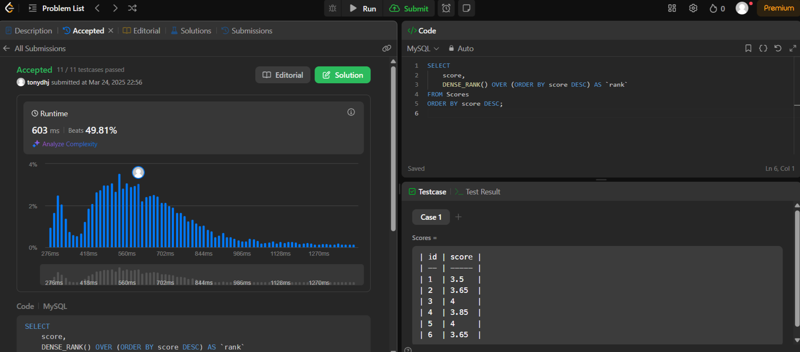
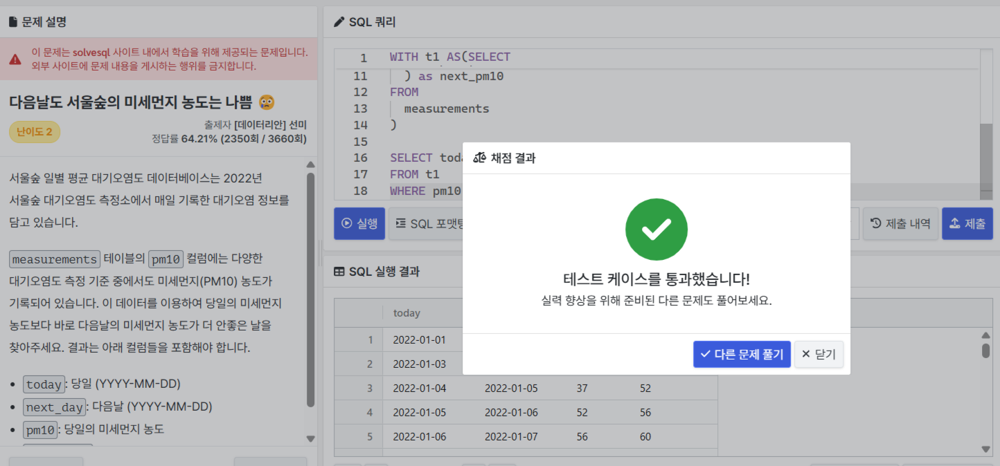
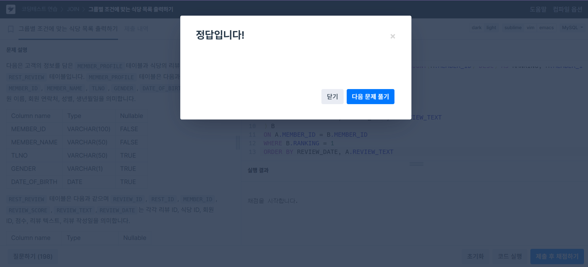

# SQL Advanced 1주차 과제

## 14.20.2 윈도우 함수 개념
- 윈도우 함수는 쿼리 행 집합에 대해 집계와 유사한 연산을 수행

- 쿼리 행 그룹을 단일 출력 행으로 축소하지 않고 각 행에 대한 결과를 생성
```sql
mysql> SELECT
         year, country, product, profit,
         SUM(profit) OVER() AS total_profit,
         SUM(profit) OVER(PARTITION BY country) AS country_profit
       FROM sales
       ORDER BY country, year, product, profit;
+------+---------+------------+--------+--------------+----------------+
| year | country | product    | profit | total_profit | country_profit |
+------+---------+------------+--------+--------------+----------------+
| 2000 | Finland | Computer   |   1500 |         7535 |           1610 |
| 2000 | Finland | Phone      |    100 |         7535 |           1610 |
| 2001 | Finland | Phone      |     10 |         7535 |           1610 |
| 2000 | India   | Calculator |     75 |         7535 |           1350 |
| 2000 | India   | Calculator |     75 |         7535 |           1350 |
| 2000 | India   | Computer   |   1200 |         7535 |           1350 |
| 2000 | USA     | Calculator |     75 |         7535 |           4575 |
| 2000 | USA     | Computer   |   1500 |         7535 |           4575 |
| 2001 | USA     | Calculator |     50 |         7535 |           4575 |
| 2001 | USA     | Computer   |   1200 |         7535 |           4575 |
| 2001 | USA     | Computer   |   1500 |         7535 |           4575 |
| 2001 | USA     | TV         |    100 |         7535 |           4575 |
| 2001 | USA     | TV         |    150 |         7535 |           4575 |
+------+---------+------------+--------+--------------+----------------+
```
- 첫 번째 OVER절은 비어 있어 쿼리 행의 전체 집합을 단일 파티션으로 취급
- 두 번째 OVER절은 국가별로 행을 분할하여 합계를 생성

윈도우 함수는 오직 `SELECT` 목록과 `ORDER BY` 절에서만 허용됨
 
쿼리 결과 행은 `FROM` 절에서 결정되며 이는 `WHERE`, `GROUP BY`, `HAVING` 처리가 끝난 후 수행됨

윈도우 함수의 실행은 `ORDER BY`, `LIMIT`, `SELECT DISTINCT`보다 먼저 이루어짐

- 윈도우 함수에서 쓰이는 집계 함수
```sql
AVG()
BIT_AND()
BIT_OR()
BIT_XOR()
COUNT()
JSON_ARRAYAGG()
JSON_OBJECTAGG()
MAX()
MIN()
STDDEV_POP(), STDDEV(), STD()
STDDEV_SAMP()
SUM()
VAR_POP(), VARIANCE()
VAR_SAMP()
```

- 윈도우 함수에서 쓰이는 비집계 함수
```sql
CUME_DIST()
DENSE_RANK()
FIRST_VALUE()
LAG()
LAST_VALUE()
LEAD()
NTH_VALUE()
NTILE()
PERCENT_RANK()
RANK()
ROW_NUMBER()
``` 

**OVER (window_spec) 구문에서(window_spec)은 여러 부분으로 구성**

```sql
window_spec:
    [window_name] [partition_clause] [order_clause] [frame_clause]
``` 
OVER()가 비어 있으면 윈도우는 모든 쿼리 행을 포함하며 윈도우 함수는 모든 행을 사용하여 결과를 계산

괄호 안에 포함된 절이 있으면 그 절이 함수 결과를 계산할 때 사용할 쿼리 행을 골라 파티셔닝하고 정렬할지를 지정

**window_spec의 구성요소**
- window_name:

쿼리의 WINDOW 절에서 정의된 윈도우의 이름

OVER 절 내에서 window_name만 단독으로 사용하면 해당 이름이 윈도우를 완전히 정의

`PARTITION BY`, `ORDER BY`, `FRAME` 절이 추가되면, 지정된 윈도우 정의를 수정하여 적용


- partition_clause (파티션 절):

`PARTITION BY` 절은 쿼리 행을 그룹으로 나누는 방식을 지정

특정 행의 윈도우 함수 결과는 해당 행이 속한 파티션 내의 행들을 기반으로 계산

`PARTITION BY`가 생략되면 모든 쿼리 행이 하나의 단일 파티션으로 간주

- order clause

`ORDER BY` 절은 각 파티션 내에서 행을 정렬하는 방식을 지정

`ORDER BY` 절에 의해 동일하게 평가되는 행들은 동등한(peers) 행으로 간주

만약 `ORDER BY` 절이 생략되면 파티션 내의 행들은 정렬되지 않으며 처리 순서 없이 모든 행이 동등한 행

## 14.20.1 윈도우 함수 설명

- `ROW NUMBER`:	해당 파티션 내의 현재 행 번호

현재 행의 순번(row number) 을 해당 파티션 내에서 1부터 시작하여 연속적으로 부여

각 행마다 고유한 번호가 매겨지며, 동률(peers) 관계에 있더라도 서로 다른 번호를 받음

- `RANK`: 파티션 내 현재 행의 순위(갭 포함)

현재 행의 순위를 해당 파티션 내에서 매기되, 동일한 값을 가진 행들은 동률(peers) 로 간주되며, 같은 순위를 받고 동률 그룹이 존재할 경우, 순위 번호가 연속적으로 증가하지 않고 건너뜀

- `DENSE RANK`: 간격 없이 파티션 내 현재 행의 순위

현재 행의 순위를 해당 파티션 내에서 연속적으로 매김

여러 개의 행이 같은 순위를 가질 경우에도 순위 번호가 연속적으로 증가
- `LAG`: 파티션 내 현재 행보다 뒤떨어진 행의 인수 값

현재 행에서 N개 이전(lags, precedes) 행의 값을 반환

 N 또는 기본값(default) 이 생략되면, 기본적으로 N은 1, 기본값은 NULL이 사용


- `LEAD`: 파티션 내 현재 행을 선도하는 행의 인수 값

현재 행에서 N개 이후(leads, follows) 행의 값을 반환

N 또는 기본값(default) 이 생략되면, 기본적으로 N은 1, 기본값은 NULL이 사용

## 14.19.1 집계 함수
**대부분의 집계 함수는 over_clause를 포함한 작성을을 통해 윈도우 함수로도 사용 가능**


- `AVG`: 인수의 평균값을 반환
`AVG(expr)` 함수는 expr의 평균값을 반환

`DISTINCT` 옵션을 사용하면 중복을 제거한 값들만 평균 계산에 포함

일치하는 행이 없을 경우 `AVG`는 NULL을 반환

expr이 NULL일 경우에도 `AVG`는 NULL을 반환

`AVG` 함수는 over_clause 가 포함될 경우 윈도우 함수 로 실행되지만 이 때 `DISTINCT` 옵션은 사용할 수 없음
```sql
SELECT student_name, AVG(test_score)
       FROM student
       GROUP BY student_name;
```
- `SUM`: 합계를 반환

`SUM(expr)` 함수는 expr의 합계를 반환

`DISTINCT` 옵션을 사용하면 중복을 제거한 값들만 합산

일치하는 행이 없거나 expr이 NULL인 경우, `SUM`은 NULL을 반환

마찬가지로 `SUM` 함수는 over_clause 가 포함될 경우 윈도우 함수 로 실행되지만 이 때 `DISTINCT` 옵션은 사용할 수 없음

# 문제 풀이

##  Rank Scores
```sql
SELECT 
    score, 
    DENSE_RANK() OVER (ORDER BY score DESC) AS `rank`
FROM Scores
ORDER BY score DESC;
```

`DENSE_RANK() OVER (ORDER BY score DESC)`

점수를 내림차순(DESC)으로 정렬하여 랭킹을 매김

동점(tie)인 경우 같은 랭킹을 부여하며 다음 순위는 연속적으로 증가

그 후 내림차순으로 정렬

 

##  다음날도 서울숲의 미세먼지 농도는 나쁨
```sql
WITH t1 AS(SELECT
  measured_at as today,
  lead(measured_at, 1) over (
    order by
      measured_at
  ) as next_day,
  pm10,
  lead(pm10, 1) over (
    order by
      measured_at
  ) as next_pm10
FROM
  measurements
)

SELECT today, next_day, pm10, next_pm10
FROM t1
WHERE pm10 < next_pm10
```
`LEAD`를 사용하여 각 날짜에 대해 다음날의 날짜와 다음날의 미세먼지 농도를 구함

`WHERE`절에서 다음날 미세먼지 농도가 더 높은 경우만 선택하여 출력



##  그룹별 조건에 맞는 식당 목록 출력하기
```sql
SELECT B.MEMBER_NAME, A.REVIEW_TEXT, DATE_FORMAT(A.REVIEW_DATE, "%Y-%m-%d") AS REVIEW_DATE
FROM REST_REVIEW A
JOIN (
    SELECT DENSE_RANK() OVER (ORDER BY COUNT(M.MEMBER_ID) DESC) AS RANKING, M.MEMBER_ID, M.MEMBER_NAME
    FROM MEMBER_PROFILE M
    JOIN REST_REVIEW R
    ON M.MEMBER_ID = R.MEMBER_ID
    GROUP BY M.MEMBER_ID
    ORDER BY RANKING, REVIEW_DATE, R.REVIEW_TEXT
) B
ON A.MEMBER_ID = B.MEMBER_ID
WHERE B.RANKING = 1
ORDER BY REVIEW_DATE, A.REVIEW_TEXT
```

`DENSE_RANK` 윈도우 함수로 각 회원별로 작성한 리뷰 수를 계산하고 리뷰 수가 많은 회원에게 높은 순위를 부여

`ORDER BY COUNT(M.MEMBER_ID) DESC` 회원별로 작성한 리뷰의 개수를 기준으로 내림차순 정렬 후 리뷰 수가 많은 회원부터 순위를 부여

`GROUP BY M.MEMBER_ID`를 사용하여 각 회원별로 그룹화한 후, 해당 회원이 작성한 리뷰 수를 `COUNT(M.MEMBER_ID)`로 계산

메인 쿼리에서 메인 쿼리는 REST_REVIEW 테이블(A)과 서브쿼리에서 반환된 결과(B)를 `MEMBER_ID` 기준으로 조인하고
`WHERE B.RANKING = 1` 조건으로로 가장 많은 리뷰를 작성한 회원의 리뷰만 선택

`DATE_FORMAT(A.REVIEW_DATE, "%Y-%m-%d") AS REVIEW_DATE`로 REVIEW_DATE를 YYYY-MM-DD 형식으로 출력, 그 후 오름차순 정렬

