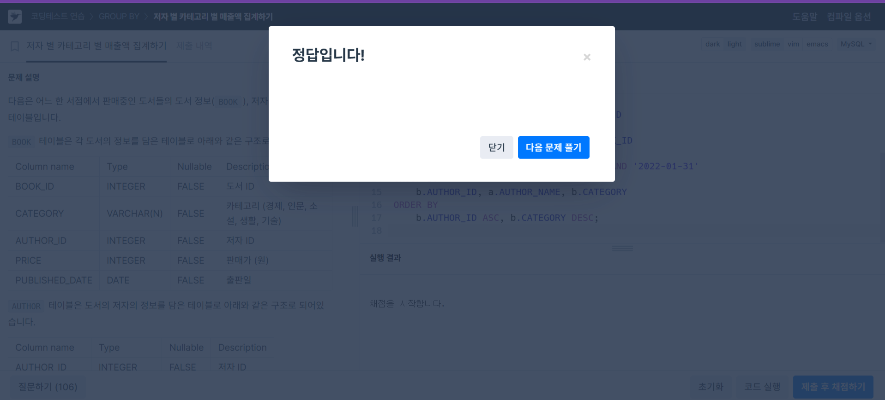
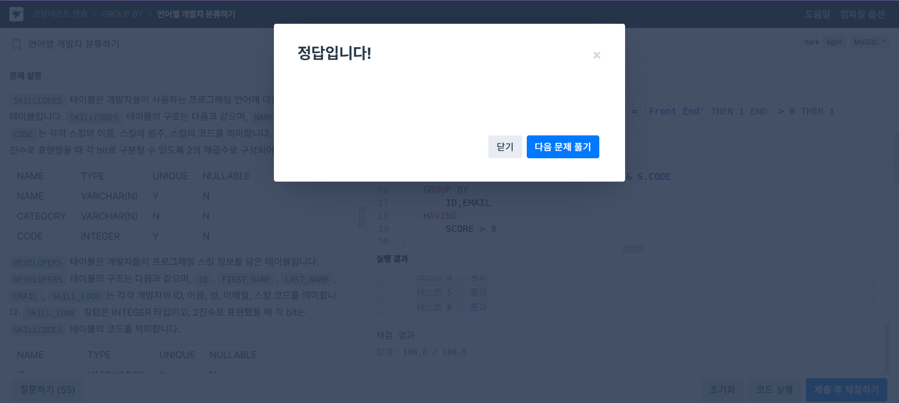

# SQL Advanced 2주차 과제

## JOIN

테이블 참조는 조인 표현식(join expression)이라고도 불리며, 테이블을 참조할 때 사용

파티션된 테이블에 대해 언급할 때, 테이블 참조는 PARTITION 절을 포함: 이 절은 특정 파티션이나 서브파티션을 지정하는 데 사용

**INNER JOIN, CROSS JOIN**

 MySQL에서 여러 테이블을 나열할 때, 각 쉼표가 `INNER JOIN`을 의미하도록 간주

 ```sql
 SELECT * FROM t1 LEFT JOIN (t2 CROSS JOIN t3 CROSS JOIN t4)
                 ON (t2.a = t1.a AND t3.b = t1.b AND t4.c = t1.c)
 ```
- MySQL에서는 `JOIN`, `CROSS JOIN`, `INNER JOIN`이 문법적으로 동일한 방식으로 처리  -> 세 가지를 서로 바꿔서 사용 가능

- 그러나 표준 SQL에서는 동등하지 않으며 `INNER JOIN`은 `ON` 과 사용되어야함  

- 소괄호는 `INNER JOIN`만 있는 경우 무시할 수 있으며, 중첩된 JOIN도 지원
```sql
SELECT t1.name, t2.salary
  FROM employee AS t1 INNER JOIN info AS t2 ON t1.name = t2.name;

SELECT t1.name, t2.salary
  FROM employee t1 INNER JOIN info t2 ON t1.name = t2.name;
```

- `INNER JOIN`과 쉼표(,)를 사용한 구문은 조인 조건이 없을 때 동일하게 카르테시안 곱을 생성

**LEFT JOIN, RIGHT JOIN**

- `LEFT JOIN`에서 오른쪽 테이블에 해당하는 행이 ON 또는 USING 절에서 조건에 맞는 일치하는 행이 없을 경우, 오른쪽 테이블의 모든 열은 NULL로 채워짐

-  한 테이블에서 다른 테이블에 대응되는 행이 없는 데이터를 쉽게 찾을 수 있음

```sql
SELECT left_tbl.*
  FROM left_tbl LEFT JOIN right_tbl ON left_tbl.id = right_tbl.id
  WHERE right_tbl.id IS NULL;
  ```
- `NATURAL JOIN`은 두 테이블에서 동일한 이름의 컬럼을 자동으로 찾아서 이를 기준으로 조인을 수행

USING 절을 사용하여 두 테이블 간에 공통된 컬럼들을 명시하는 것과 동일한 효과를 내기 때문에 `LEFT JOIN`과 같은 효과 

- `RIGHT JOIN`은 `LEFT JOIN`과 유사하게 작동하지만, 오른쪽 테이블을 기준으로 결과를 반환 / 왼쪽 테이블의 모든 행을 포함하고, 오른쪽 테이블에 일치하는 값이 없는 경우 NULL을 반환

- 다양한 데이터베이스 시스템에서 동일하게 작동하는 코드를 작성하려면 `RIGHT JOIN` 대신 `LEFT JOIN`을 사용하는 것이 더 좋음

- `OUTER JOIN` 에서는 두 테이블을 조인할 때, 하나의 테이블에서 값을 찾을 수 없는 경우 NULL 값이 들어가게 되고고 이 때, coalesced column은 NULL이 아닌 값을 선택

##  GROUP BY

SQL-92 및 그 이전의 표준에서는 `GROUP BY` 절에 포함되지 않은 비집계 컬럼을 `SELECT`, `HAVING`, 또는 `ORDER BY`에서 참조하는 것이 불법이었음 

이후 버전의 SQL에서는 이러한 제한이 일부 완화되어 비집계 컬럼이 `GROUP BY` 절에 포함되지 않고도 사용할 수 있게 되었고  `GROUP BY` 절에서 집계 함수만 사용할 수 있는 경우가 많아졌음
```sql
SELECT o.custid, c.name, MAX(o.payment)
  FROM orders AS o, customers AS c
  WHERE o.custid = c.custid
  GROUP BY o.custid;
```

- `GROUP BY`가 없으면 쿼리는 전체 테이블을 하나의 그룹으로 취급

 - 결과로 반환되는 행은 하나의 그룹에서 여러 개의 값이 나올 수 있으며, 이 값들 중 어떤 값이 선택될지 결정할 수 없음

 - 그 중 어느 것을 선택해도 문제가 되지 않으면 `ANY_VALUE()`를 사용하여 해당 값을 반환하도록 사용 가능
```sql
 SELECT ANY_VALUE(name), MAX(age) FROM t;
 ```

 - `HAVING` 선택 목록의 별칭 표현식에 대한 절의 참조나 집계 열에서의 별칭을 허용
 ```sql
 SELECT name, COUNT(name) FROM orders
  GROUP BY name
  HAVING COUNT(name) = 1;
 ```
 ```sql
 SELECT name, COUNT(name) AS c FROM orders
  GROUP BY name
  HAVING c = 1;
 ```

## HAVING

`HAVING` 절은 그룹 단위에서 선택 조건을 지정

보통 `GROUP BY` 절과 함께 사용되어 그룹화된 데이터에 대해 조건을 적용 / 집계 함수를 사용할 수 있으며, 그룹화된 결과에 대해 조건을 설정

쿼리 실행의 거의 마지막 단계에 적용 / 집계 함수나 `GROUP BY` 절에 포함된 컬럼을 기준으로 그룹화된 데이터에 조건을 걺

HAVING 절에서 모호한 컬럼을 참조하면 MySQL에서 경고가 발생할 수 있음

`HAVING` 절에서 `WHERE` 절이 할 수 없는 집계 함수를 참조하는 경우
```sql
SELECT user, MAX(salary) FROM users
  GROUP BY user HAVING MAX(salary) > 10;
```

# 문제 풀이

##  저자 별 카테고리 별 매출액 집계하기

```sql
SELECT 
    b.AUTHOR_ID, 
    a.AUTHOR_NAME, 
    b.CATEGORY, 
    SUM(bs.SALES * b.PRICE) AS TOTAL_SALES
FROM 
    BOOK b
JOIN 
    AUTHOR a ON b.AUTHOR_ID = a.AUTHOR_ID
JOIN 
    BOOK_SALES bs ON b.BOOK_ID = bs.BOOK_ID
WHERE 
    bs.SALES_DATE BETWEEN '2022-01-01' AND '2022-01-31'
GROUP BY 
    b.AUTHOR_ID, a.AUTHOR_NAME, b.CATEGORY
ORDER BY 
    b.AUTHOR_ID ASC, b.CATEGORY DESC;
```

BOOK 테이블과 AUTHOR 테이블을 저자 ID를 기준으로 조인

BOOK_SALES 테이블을 도서 ID를 기준으로 조인

2022년 1월에 판매된 데이터를 필터링 후 판매량(SALES)과 판매가(PRICE)를 곱하여 매출액을 계산하고 SUM 함수로 집계

저자 ID, 저자명, 카테고리별로 그룹화하여 매출액을 집계 후 저자 ID를 오름차순으로 정렬하고, 같은 저자 ID 내에서는 카테고리를 내림차순으로 정렬

 

##  언어별 개발자 분류하기

```sql
WITH J AS (
    SELECT 
        ID,
        EMAIL,
        CASE 
           WHEN COUNT(CASE WHEN CATEGORY = 'Front End' THEN 1 END) > 0 AND 
                COUNT(CASE WHEN NAME = 'Python' THEN 1 END) > 0 
                THEN 3
           WHEN COUNT(CASE WHEN NAME = 'C#' THEN 1 END) > 0 THEN 2
           WHEN COUNT(CASE WHEN CATEGORY = 'Front End' THEN 1 END) > 0 THEN 1
        END AS SCORE
    FROM
        DEVELOPERS AS D
    JOIN 
        SKILLCODES AS S ON D.SKILL_CODE & S.CODE
    GROUP BY 
        ID,EMAIL
    HAVING 
        SCORE > 0
)
SELECT 
    CASE 
        WHEN SCORE = 3 THEN 'A'
        WHEN SCORE = 2 THEN 'B'
        WHEN SCORE = 1 THEN 'C'
    END AS GRADE,
    ID,
    EMAIL
FROM 
    J
ORDER BY 
    1,2
```

- 서브쿼리
```
DEVELOPERS와 SKILLCODES를 비트 연산을 통해 조인

각 개발자가 Front End 카테고리 스킬을 얼마나 가지고 있는지 확인

COUNT(CASE WHEN CATEGORY = 'Front End' THEN 1 END)을 사용해 Front End 스킬의 개수 확인인

HAVING절을 통해 Front End 스킬을 가진 개발자만 필터링
```
- 외부 쿼리
```
서브쿼리에서 반환된 SCORE를 기반으로 각 개발자에게 GRADE를 부여

SCORE 값에 따라 'A', 'B', 'C'로 구분

최종적으로 GRADE, ID, EMAIL을 반환하고, 이를 GRADE와 ID 기준으로 오름차순으로 정렬
```
     
