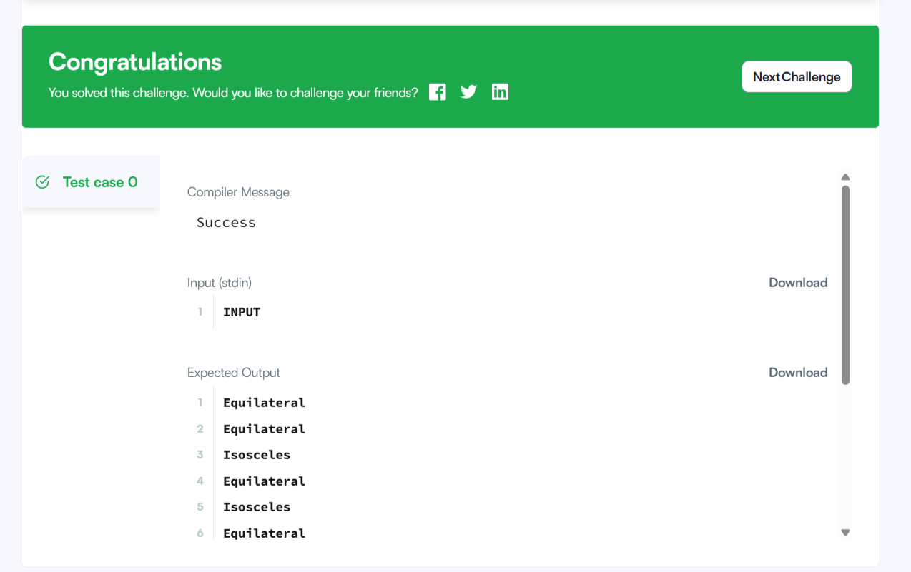
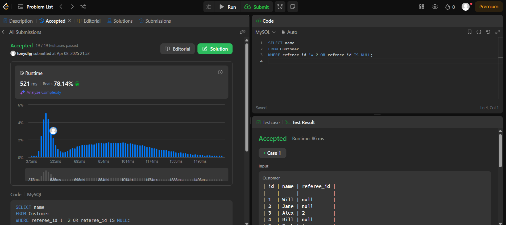

# SQL Advanced 2주차 과제

## CASE문 & 논리 연산자 활용

**1. CASE WHEN**

 ```sql
CASE value
    WHEN compare_value THEN result
    [WHEN compare_value THEN result ...]
    [ELSE result]
END
 ```
이 구문은 `value = compare_value` 비교에서 처음으로 참이 되는 항목의 결과를 반환

만약 일치하는 것이 없다면 `ELSE` 절의 결과를 반환하고 `ELSE`가 없으면 `NULL`을 반환

```sql
CASE
    WHEN condition THEN result
    [WHEN condition THEN result ...]
    [ELSE result]
END
```
이 구문은 각 조건 중에서 처음으로 참이 되는 조건의 결과를 반환합니다.

조건이 모두 거짓이면 `ELSE` 절의 결과를 반환하고, `ELSE`가 없으면 `NULL`을 반환

`CASE` 표현식의 `THEN`, `ELSE`에 나오는 결과 값들의 타입을 종합해서 전체 `CASE` 표현식의 반환 타입을 결정

**2. IF / IFNULL / NULLIF**

조건문을 간단히 표현할 때 사용되는 함수

- `IF(expr1,expr2,expr3)`

       -하나만 `NULL`인 경우:
        `expr2` 또는 `expr3` 중 하나만 명시적으로 `NULL`이면 → NULL이 아닌 쪽의 타입이 결과 타입

       -기본 반환 타입:
        `expr2` 또는 `expr3` 중 하나라도 문자열이면 → 결과는 문자열

       -둘 다 문자열일 때:

        둘 중 하나라도 대소문자 구분이면 → 결과도 case-sensitive

        하나라도 실수를 반환하면 → 결과는 실수

        둘 다 정수 → 결과는 정수

```sql
mysql> SELECT IF(1>2,2,3);
        -> 3
mysql> SELECT IF(1<2,'yes','no');
        -> 'yes'
mysql> SELECT IF(STRCMP('test','test1'),'no','yes');
        -> 'no'
```

`IFNULL(expr1,expr2)`

     -NULL 처리용으로 자주 사용되는 함수
     - expr1이 NULL이 아니면 → expr1 반환
       expr1이 NULL이면 → expr2 반환
    
```sql
    mysql> SELECT IFNULL(1,0);
        -> 1
    mysql> SELECT IFNULL(NULL,10);
        -> 10
    mysql> SELECT IFNULL(1/0,10);
        -> 10
    mysql> SELECT IFNULL(1/0,'yes');
        -> 'yes'
```

`NULLIF(expr1,expr2)`

    -두 값이 같은 경우에는 `NULL`을 반환하고, 다르면 첫 번째 값을 그대로 반환하는 간단한 비교 함수

    -expr1 = expr2가 **참(TRUE)**이면 → NULL 반환

     그렇지 않으면 → expr1 반환
```sql
    mysql> SELECT NULLIF(1,1);
        -> NULL
    mysql> SELECT NULLIF(1,2);
        -> 1
```

**3. COALESCE**

`COALESCE(value,...)`

    -리스트에서 처음으로 NULL이 아닌 값을 반환
     모든 값이 NULL이면 → 결과도 NULL

    -왼쪽부터 차례로 평가해서 처음으로 NULL이 아닌 값을 반환
    -전부 NULL이면 → NULL 반환

타입 결정 우선순위:

문자열이 하나라도 있으면 → 문자열(STRING)

실수가 있으면 → 실수(REAL)

정수만 있으면 → 정수(INTEGER)

NULL 값은 타입 결정에 영향을 주지 않음

```sql
mysql> SELECT COALESCE(NULL,1);
        -> 1
mysql> SELECT COALESCE(NULL,NULL,NULL);
        -> NULL
```

# 문제 풀이

##  Type of Triangle

```sql
SELECT
  CASE
    WHEN A + B <= C OR A + C <= B OR B + C <= A THEN 'Not A Triangle'
    WHEN A = B AND B = C THEN 'Equilateral'
    WHEN A = B OR B = C OR A = C THEN 'Isosceles'
    ELSE 'Scalene'
  END AS TriangleType
FROM TRIANGLES;
```

Not A Triangle: 먼저, 삼각형의 조건을 만족하지 않는 경우를 확인합니다. 즉, 세 변의 길이가 삼각형의 조건을 충족하지 않으면 'Not A Triangle'을 반환

Equilateral: 세 변의 길이가 모두 동일한 경우를 확인하여 'Equilateral'을 반환

Isosceles: 두 변의 길이만 동일한 경우를 확인하여 'Isosceles'를 반환

Scalene: 위의 조건에 해당하지 않는 나머지 경우는 세 변의 길이가 모두 다른 경우이므로 'Scalene'을 반환




##  Find Customer Referee

```sql
SELECT name
FROM Customer
WHERE referee_id != 2 OR referee_id IS NULL;
```

SELECT name: Customer 테이블에서 name 열을 선택

FROM Customer: Customer 테이블에서 데이터를 가져옴옴

WHERE referee_id != 2 OR referee_id IS NULL: referee_id가 2가 아니거나 NULL인 행을 필터링

 