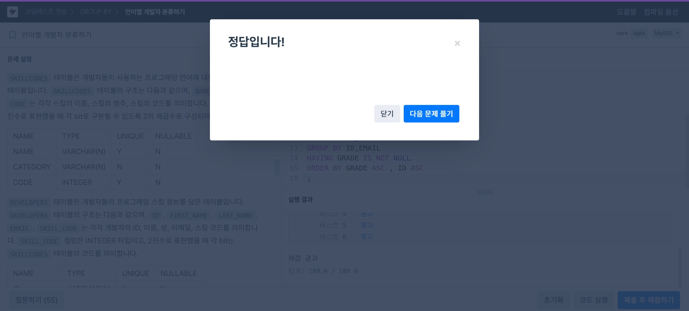

# SQL Advanced 4주차 과제

## WITH RECURSIVE

재귀 CTE는 자기 자신을 다시 참조하는 하위 쿼리를 포함하는 구문 

CTE 정의 중 하나라도 자기 자신을 참조하는 경우, WITH RECURSIVE로 시작해야 함

자기 참조가 없는 경우에는 RECURSIVE 키워드를 생략 가능

- 두 개의 SELECT 문을 UNION으로 연결하여 구성

- 첫 번째 SELECT 문은 초기값을 반환하며 CTE 자신을 참조하지 않음

- 두 번째 SELECT 문은 CTE 자신을 FROM 절에서 참조하며 재귀적으로 추가 행을 생성

- 재귀는 새 행이 더 이상 생성되지 않을 때 종료

SELECT가 여러 개인 경우
각 SELECT 부분(비재귀, 재귀)은 내부적으로 여러 SELECT 문을 UNION으로 묶은 구조일 수 있음

컬럼 타입 결정 방식
CTE 결과의 컬럼 타입은 오직 비재귀 SELECT 부분의 컬럼을 기준으로 결정됨

재귀 SELECT 부분은 타입 결정에 관여하지 않음

CTE 컬럼들은 모두 NULL을 허용

- 각 반복(iteration)마다, 해당 SELECT 문은 이전 행 집합에서의 n 값보다 1 큰 새 값을 가지는 행을 생성함

- 첫 번째 반복은 **초기 행 집합 (n = 1)**을 기반으로 실행되어 1 + 1 = 2를 생성함

- 두 번째 반복은 n = 2에서 실행되어 2 + 1 = 3을 생성함

- 반복은 n < 5 조건이 더 이상 성립하지 않을 때 종료됨

- 재귀 CTE의 재귀 부분에서 비재귀 부분보다 더 넓은(긴 문자열 등) 값을 생성하는 경우, 비재귀 부분에서 해당 컬럼의 너비를 미리 넓혀주는 작업이 필요할 수 있음
```sql
WITH RECURSIVE cte AS
(
  SELECT 1 AS n, 'abc' AS str
  UNION ALL
  SELECT n + 1, CONCAT(str, str) FROM cte WHERE n < 3
)
SELECT * FROM cte;
```

재귀 CTE의 재귀 SELECT 부분에서 사용하면 안되는 구문:

- SUM()과 같은 집계 함수

- 윈도우 함수

- GROUP BY

- ORDER BY

- DISTINCT

- LIMIT을 재귀 SELECT에 사용하는 경우, 요청된 행 수만큼 생성되면 즉시 반복을 중단하므로 성능이 더 향상

WITH RECURSIVE 사용 예시
```sql
WITH RECURSIVE cte (n) AS
(
  SELECT 1
  UNION ALL
  SELECT n + 1 FROM cte LIMIT 10000
)
SELECT /*+ MAX_EXECUTION_TIME(1000) */ * FROM cte;
```

## 문제 풀이 - 입양 시각 구하기 (2)
```sql
WITH RECURSIVE hours AS (
    SELECT 0 AS hour
    UNION ALL
    SELECT hour + 1 FROM hours WHERE hour < 23
)
SELECT
    hours.hour,
    COUNT(ANIMAL_OUTS.ANIMAL_ID) AS count
FROM
    hours
LEFT JOIN
    ANIMAL_OUTS ON HOUR(ANIMAL_OUTS.DATETIME) = hours.hour
GROUP BY
    hours.hour
ORDER BY
    hours.hour;
```
재귀 CTE:

- WITH RECURSIVE를 사용하여 0부터 23까지의 숫자를 생성

- SELECT 0 AS hour: 시작값 0을 설정

- UNION ALL SELECT hour + 1 FROM hours WHERE hour < 23: hour 값을 1씩 증가시켜 23까지 생성

LEFT JOIN:

- 생성한 hours 테이블과 ANIMAL_OUTS 테이블을 HOUR(ANIMAL_OUTS.DATETIME) = hours.hour 조건으로 LEFT JOIN

- 이렇게 하면 입양 기록이 없는 시간대도 포함

집계 및 정렬:

- COUNT(ANIMAL_OUTS.ANIMAL_ID): 각 시간대별 입양 건수를 계산

- GROUP BY hours.hour: 시간대별로 그룹화

- ORDER BY hours.hour: 시간대 순으로 정렬

 


## GROUP CONCAT

그룹 내의 NULL이 아닌 값들을 연결(concatenate)하여 문자열로 반환

그룹 내에 NULL이 아닌 값이 하나도 없을 경우 결과로 NULL을 반환

```sql
 SELECT student_name,
         GROUP_CONCAT(DISTINCT test_score
                      ORDER BY test_score DESC SEPARATOR ' ')
       FROM student
       GROUP BY student_name;
```
- GROUP_CONCAT() 함수를 통해 그룹 내 여러 값들을 문자열로 이어붙인 결과를 얻을 수 있음

- 중복된 값을 제거하고자 할 경우, DISTINCT 절을 사용

- 정렬은 ORDER BY 절을 사용함

- 내림차순 정렬은 정렬 기준 컬럼에 DESC 키워드를 추가

- 기본 정렬 순서는 오름차순


## 문제 풀이 -우유와 요거트가 담긴 장바구니

```sql
SELECT CART_ID
FROM CART_PRODUCTS
WHERE NAME IN ('Milk', 'Yogurt')
GROUP BY CART_ID
HAVING COUNT(DISTINCT NAME) = 2
ORDER BY CART_ID;
```

- WHERE NAME IN ('Milk', 'Yogurt'): 'Milk'와 'Yogurt' 상품만 선택

- GROUP BY CART_ID: 장바구니별로 그룹화

- HAVING COUNT(DISTINCT NAME) = 2: 두 상품 모두를 포함한 장바구니만 선택

- ORDER BY CART_ID: 결과를 CART_ID 오름차순으로 정렬

 

## 문제 풀이 -우유와 요거트가 담긴 장바구니
```sql
SELECT
        CASE 
        WHEN GROUP_CONCAT(B.NAME) LIKE ("%Python%") AND GROUP_CONCAT(B.CATEGORY) LIKE("%Front%") THEN "A"
        WHEN GROUP_CONCAT(B.NAME) LIKE ("%C#%") THEN "B"
        WHEN GROUP_CONCAT(B.CATEGORY) LIKE ("%Front%") THEN "C"
        END AS  GRADE ,
        A.ID,
        A.EMAIL
                                               
FROM DEVELOPERS  AS A
JOIN SKILLCODES AS B
ON (A.SKILL_CODE & B.CODE = B.CODE)
GROUP BY ID,EMAIL 
HAVING GRADE IS NOT NULL
ORDER BY GRADE ASC , ID ASC
;
```
- DEVELOPERS 테이블과 SKILLCODES 테이블을 비트 AND 연산을 사용하여 조인
-한 개발자가 보유한 여러 기술 중 해당 기술코드에 해당하는 항목만 필터링하기 위함

- 한 명의 개발자가 가진 모든 기술 이름과 기술 CATEGORY를 문자열로 연결/ 이 문자열을 조건문에서 사용하여 LIKE로 포함 여부를 판별

- 'A' 등급: Python 스킬을 보유하면서 Front End 관련 기술도 있음

- 'B' 등급: C# 스킬만 보유

- 'C' 등급: Front End 관련 기술만 보유

- 우선순위에 따라 CASE 절을 구성

- 같은 개발자에 대해 중복된 결과를 제거하고, ID와 EMAIL 기준으로 그룹화 후 GRADE가 NULL인 행은 제외

 