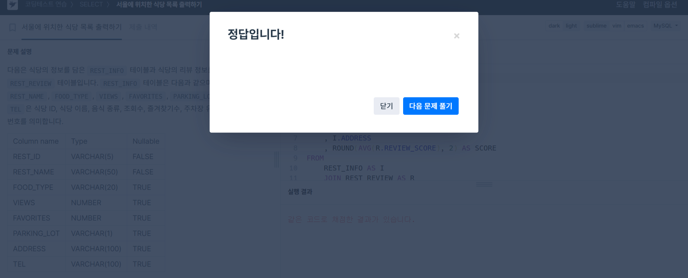
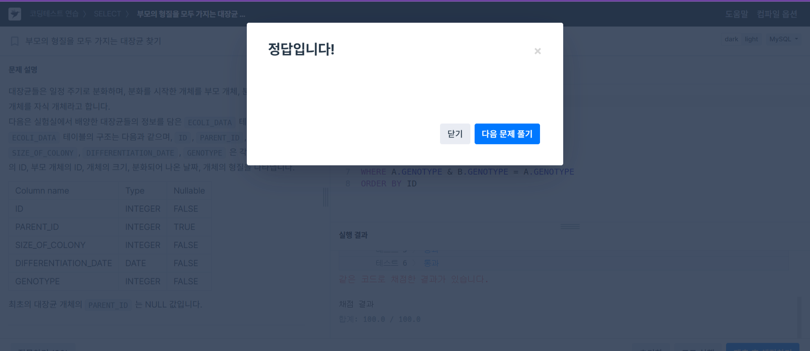

# SQL Advanced 5주차 과제

## 정규 표현식 (REGEXP)

1. REGEXP_LIKE()

- 문자열 expr이 정규표현식 pat에 일치하면 1, 일치하지 않으면 0, 둘 중 하나가 NULL이면 결과도 NULL을 반환

- 정규표현식으로 작성되며 리터럴 문자열뿐 아니라 컬럼이나 문자열 표현식도 가능 

- c : 대소문자 구분 (기본값)

  i : 대소문자 무시

  m : 멀티라인 모드. 줄바꿈 문자(\n)를 문자열 내부에서도 인식

  n : .이 줄바꿈 문자도 포함하도록 함 (.은 원래 한 줄 안에서만 동작)

  u : 유닉스 방식 줄 끝 처리. 오직 \n만 줄 끝으로 인식

  다음 문자열들을 조합해서 작성 가능
```sql
  SELECT REGEXP_LIKE('CamelCase', 'CAMELCASE');
  ```
  일치하지 않음 ->  결과 0

  ```sql
  SELECT REGEXP_LIKE('CamelCase', 'CAMELCASE', 'i');
  ```
  일치함 -> 결과 1   


2. REGEXP_REPLACE() 

- 문자열 expr에서 정규표현식 pat에 일치하는 부분을 repl로 바꾼 문자열을 반환

- expr, pat, 또는 repl 중 하나라도 NULL이면 결과는 NULL

- pos (시작 위치)

  expr 문자열에서 검색을 시작할 위치 (기본값: 1)

  occurrence (치환할 횟수)
  몇 번째 일치를 치환할 것인지 지정.

  기본값: 0 → 모든 일치 항목을 전부 치환

  match_type
  매칭 방식 제어. REGEXP_LIKE()와 동일하며 다음 옵션 가능:

  c: 대소문자 구분

  i: 대소문자 무시

  m: 멀티라인 모드 (^, $가 줄바꿈 기준으로 동작)

  n: .이 줄바꿈도 포함

  u: 유닉스 스타일 줄 끝 처리 (\n만 줄바꿈으로 인식)
```sql
mysql> SELECT REGEXP_REPLACE('abc def ghi', '[a-z]+', 'X', 1, 3);
```

3. REGEXP_SUBSTR()

- 문자열 expr에서 정규표현식 pat에 일치하는 부분의 문자열(substring)을 반환

- 일치하는 부분이 없으면 NULL 반환

- expr이나 pat이 NULL이면 결과도 NULL

- pos (시작 위치)

  expr에서 검색을 시작할 위치 (기본값: 1)

  occurrence (몇 번째 일치)
  몇 번째로 일치하는 부분을 반환할지 지정

  기본값: 1 → 첫 번째 일치만 반환

  match_type
  매칭 방식 제어 (REGEXP_LIKE()와 동일):

  c: 대소문자 구분

  i: 대소문자 무시

  m: 멀티라인 모드

  n: .이 줄바꿈 문자 포함

  u: 유닉스 스타일 줄 끝 처리
```sql
  SELECT REGEXP_SUBSTR('abc123xyz456', '[0-9]+', 1, 2);
  ```

## 비트 연산자
 
1. &

 - a와 b에 대해 비트 단위 AND 연산을 수행

 - a 또는 b가 바이너리 문자열 타입이고, 둘 중 하나 이상이 16진수 리터럴, 비트 리터럴, NULL이 아닌 경우

- 동작: 문자열 길이만큼 비트 AND 수행

- 결과: 같은 길이의 바이너리 문자열 반환

- 만약 두 문자열 길이가 다르면 오류 발생
```sql
SELECT 29 & 15;
        -> 13
```

2. |

- a와 b 사이에 비트 단위 OR 연산을 수행

- 조건: a와 b 중 하나라도 바이너리 문자열 타입이고, 둘 중 하나 이상이 16진수 리터럴, 비트 리터럴, 또는 NULL이 아닐 경우

- 동작: 각 비트별 OR 연산

- 결과: 입력 문자열과 같은 길이의 바이너리 문자열 반환
```sql
SELECT 29 | 15;
        -> 31
```

3. ^

- a와 b 사이의 비트 단위 배타적 논리합 (XOR) 연산을 수행

- 조건: a 또는 b 중 하나가 바이너리 문자열 타입이고, 둘 중 하나 이상이 16진수 리터럴, 비트 리터럴, NULL이 아닐 경우

- 결과: 같은 길이의 바이너리 문자열 반환

- 주의: 두 문자열 길이가 다르면 오류 발생 
```sql
SELECT 1 ^ 1;
        -> 0
```

4. <<

- a의 비트들을 왼쪽으로 b비트만큼 이동시키는 연산

- 바이너리 문자열 평가
-     조건: a가 바이너리 문자열 타입이고, 16진수 리터럴, 비트 리터럴, NULL이 아닌 경우

      결과: a와 같은 길이의 바이너리 문자열 반환

      b는 정수로 평가됨

- 숫자 평가

-     조건: 위 조건에 해당하지 않으면 정수로 간주

      처리: a는 **unsigned 64비트 정수 (BIGINT UNSIGNED)**로 변환 후 시프트 수행

      결과: 정수값 반환
```sql
SELECT 1 << 2;
        -> 4
```

5. >>

- a의 비트들을 오른쪽으로 b비트만큼 이동

-  바이너리 문자열 평가 (binary-string evaluation)
-     조건: a가 바이너리 문자열 타입이고, 16진수 리터럴, 비트 리터럴, NULL이 아닌 경우

      결과: a와 같은 길이의 바이너리 문자열 반환

      b는 정수로 간주됨

- 숫자 평가 (numeric evaluation)

      조건: 위 조건이 아니면 a는 숫자로 간주

      처리: a를 **부호 없는 64비트 정수 (UNSIGNED BIGINT)**로 변환한 후 시프트 수행

      결과: 정수값 반환
```sql
SELECT 4 >> 2;
        -> 1
```


## 문제 풀이 - 서울에 위치한 식당 목록 출력하기

```sql
SELECT
    I.REST_ID
    , I.REST_NAME
    , I.FOOD_TYPE
    , I.FAVORITES
    , I.ADDRESS
    , ROUND(AVG(R.REVIEW_SCORE), 2) AS SCORE
FROM 
    REST_INFO AS I
    JOIN REST_REVIEW AS R
    ON I.REST_ID = R.REST_ID
WHERE ADDRESS LIKE '서울%'
GROUP BY 1, 2, 3, 4, 5
ORDER BY SCORE DESC, FAVORITES DESC
```
REST_INFO 테이블과 REST_REVIEW 테이블을 REST_ID 기준으로 JOIN

ADDRESS가 '서울'로 시작하는 행만 선택 (서울%)

각 식당별로 REVIEW_SCORE의 평균을 계산 (ROUND(..., 2)로 소수 둘째 자리 반올림)

결과는 SCORE 내림차순 → FAVORITES 내림차순으로 정렬
 

## 문제 풀이 - 부모의 형질을 모두 가지는 대장균 찾기
```sql
SELECT B.ID, B.GENOTYPE 
    , A.GENOTYPE AS PARENT_GENOTYPE
FROM ECOLI_DATA AS A
  JOIN ECOLI_DATA AS B
  ON A.ID = B.PARENT_ID
WHERE A.GENOTYPE & B.GENOTYPE = A.GENOTYPE
ORDER BY ID
```  
ECOLI_DATA 테이블에서 **부모(A)**와 **자식(B)**의 관계를 **PARENT_ID**로 연결

A.GENOTYPE & B.GENOTYPE = A.GENOTYPE 조건은:

자식(B)의 유전형이 부모(A)의 유전형을 모두 포함하고 있는지 확인

비트 AND 연산이므로:

부모의 유전형이 00101이고

자식의 유전형이 10101이면
→ 00101 & 10101 = 00101 → 포함됨 → 조건 성립

결국, 부모의 유전자가 자식의 유전자 내에 모두 존재할 때만 선택


