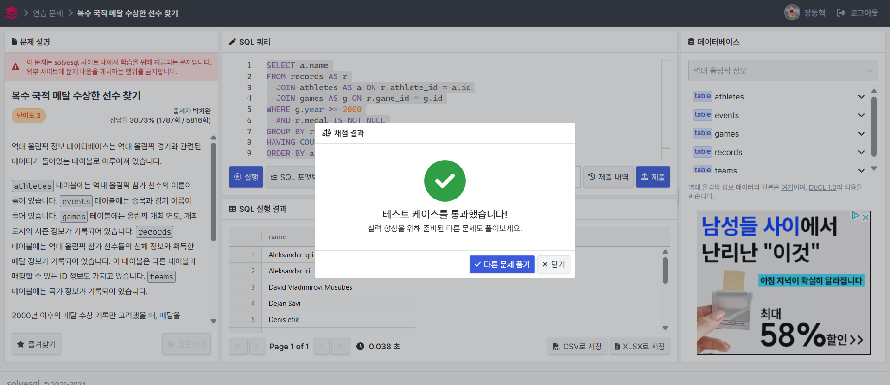
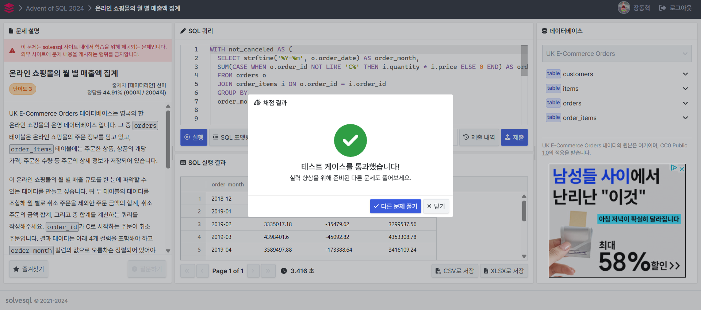
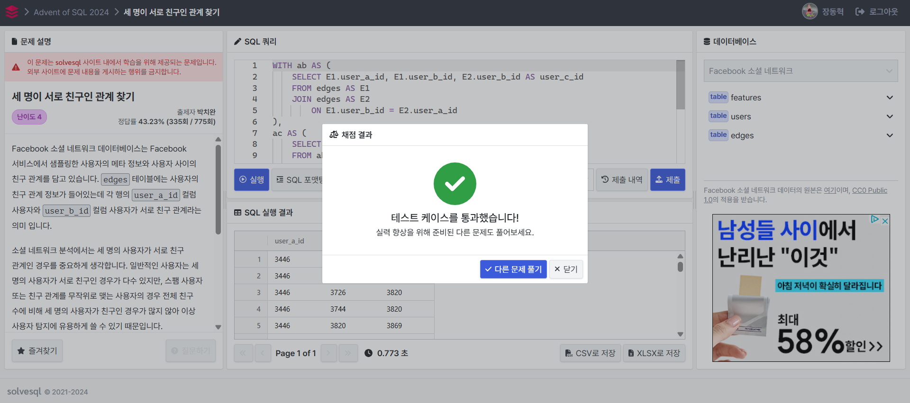

# SQL Advanced 6주차 과제

## 문제(1) - 복수 국적 메달 수상한 선수 찾기
```sql
SELECT a.name
FROM records AS r
  JOIN athletes AS a ON r.athlete_id = a.id
  JOIN games AS g ON r.game_id = g.id
WHERE g.year >= 2000
  AND r.medal IS NOT NULL
GROUP BY r.athlete_id
HAVING COUNT(DISTINCT r.team_id)>=2
ORDER BY a.name;
```

JOIN 절을 통해 records, athletes, games 세 테이블을 통합하여, 선수 이름과 경기 연도 정보를 함께 사용할 수 있도록 구성

WHERE 절에서 분석 대상을 2000년 이후로 한정하고, 메달을 획득한 경우(medal IS NOT NULL)만을 필터링

GROUP BY 절을 통해 선수별(r.athlete_id)로 데이터를 그룹화 후후

HAVING 절을 이용해, 서로 다른 team_id의 개수가 2개 이상인 경우만을 추출

-> 선수가 2개 이상의 국가나 팀을 대표하여 메달을 획득한 사례만을 대상으로 한다는 의미

ORDER BY 절로로 결과를 선수 이름(a.name)의 오름차순 정렬로 출력

 

## 문제(2) - 온라인 쇼핑몰의 월 별 매출액 집계

```sql
WITH not_canceled AS (
  SELECT strftime('%Y-%m', o.order_date) AS order_month,
  SUM(CASE WHEN o.order_id NOT LIKE 'C%' THEN i.quantity * i.price ELSE 0 END) AS ordered_amount
  FROM orders o 
  JOIN order_items i ON o.order_id = i.order_id
  GROUP BY
  order_month),


  canceled AS (
   SELECT strftime('%Y-%m', o.order_date) AS order_month,
   SUM(CASE WHEN o.order_id LIKE 'C%' THEN i.quantity * i.price ELSE 0 END) AS canceled_amount
   FROM orders o
   JOIN order_items i ON o.order_id = i.order_id
   GROUP BY
   order_month 
  )

SELECT C.order_month, ordered_amount, canceled_amount, ordered_amount+canceled_amount as total_amount
FROM canceled C JOIN not_canceled N
ON C.order_month = N.order_month
ORDER BY C.order_month
  ```

1. -  order_id가 'C'로 시작하지 않는 주문을 정상 주문으로 간주하고 월별 총 매출을 ordered_amount로 계산

     - 주문 날짜를 정규화

     - 각 주문 항목별로 quantity * price를 계산하고 월별로 합산

2.   - order_id가 'C'로 시작하는 주문을 취소 주문으로 간주하고 월별 취소 금액을 canceled_amount로 계산

     - 구조는 not_canceled와 동일하고 조건만 반대로 설정

3. - canceled와 not_canceled를 월별(order_month)로 조인하여 두 데이터를 통합

   - 정상 주문 금액(ordered_amount)과 취소 주문 금액(canceled_amount), 그리고 합계계(total_amount)를 출력

    -  출력 결과는 월별로 오름차순 정렬

 


## 문제(3) - 세 명이 서로 친구인 관계 찾기

```sql
WITH ab AS (
    SELECT E1.user_a_id, E1.user_b_id, E2.user_b_id AS user_c_id
    FROM edges AS E1
    JOIN edges AS E2 
        ON E1.user_b_id = E2.user_a_id
),
ac AS (
    SELECT ab.user_a_id, ab.user_b_id, ab.user_c_id
    FROM ab
    JOIN edges AS E3
        ON ((ab.user_a_id = E3.user_a_id AND ab.user_c_id = E3.user_b_id) 
         OR (ab.user_a_id = E3.user_b_id AND ab.user_c_id = E3.user_a_id))
)

SELECT * 
FROM ac
WHERE user_a_id < user_b_id 
AND user_b_id < user_c_id
AND 3820 IN (user_a_id, user_b_id, user_c_id)
```

1. ab의 CTE

        - 두 단계 연결을 찾아내는 역할할

        -  A—B—C 관계에서, A → B (E1), B → C (E2)

         - A—B—C 구조를 user_a_id = A, user_b_id = B, user_c_id = C로 표현

2. ac의 CTE 

       - 셋의 관계에 (A—C)이 존재하는지 확인

       - A—B—C 중 A와 C도 연결되어 있다면 A—B—C—A가 되어 삼각 관계가가 완성

       - 이 조인은 셋의 관계를 확인하는는 역할

3. 최종 SELECT 

       - A–B–C는 순서에 따라 여러 번 발견될 수 있기 때문에 user_a_id < user_b_id < user_c_id 조건으로 한 번만 포함되도록 필터링


       - 세 친구 중 최소 한 명이 3820인 경우만 추출, 이는 친구가 포함된 삼각 관계계를 찾는 데 사용됨


 
